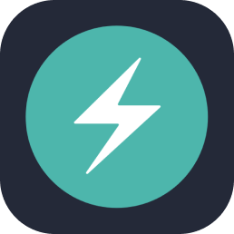

  
  

     
  

   
   
  
  <table>
    <tr>
      <td align="center">🛠 Develop</td>
      <td>
        
        
        
        
        
      </td>
    </tr>
    <tr>
      <td align="center">🎨 Design</td>
      <td>
        
        
        
      </td>
    </tr>
    <tr>
      <td align="center">⚡ Tools</td>
      <td>
        
        
        
        
        
      </td>
    </tr>
  </table>
   
  

    
    
  

   
  

   
  <em>I look forward to solving great challenges together with you. ❤️‍🔥</em>
   
   
  
   
   
   
  <a href="https://open.spotify.com/intl-ja/track/05OKAm2V620z0Q1j5XVOt2?si=a47bac9bbeff4a59" target="_blank" aria-label="back numberのこぼれ落ちてをSpotifyで聴く">
    <svg width="300" height="100" xmlns="http://www.w3.org/2000/svg">
      <rect x="0" y="0" width="300" height="100" rx="16" ry="16" fill="#9c1917" />
      <clipPath id="icon">
        <rect x="14" y="14" width="72" height="72" rx="8" ry="8" />
      </clipPath>
      <image href="https://image-cdn-fa.spotifycdn.com/image/ab67616d00001e024951a4f5f9d719dfa4ef3d75" x="14" y="14" width="72" height="72" clip-path="url(#icon)" />
      <g font-family="sans-serif" >
        <text x="100" y="40" font-size="20px" font-weight="900" fill="#ffffff">こぼれ落ちて</text>
        <text x="100" y="65" font-size="12px" font-weight="400" fill="#ffbeb3">back number</text>
      </g>
      <g transform="translate(260,38)" stroke="#ffbeb3" stroke-width="2" stroke-linecap="round" stroke-linejoin="round" fill="#ffbeb3">
        <path d="M1 12C1 5.925 5.925 1 12 1s11 4.925 11 11-4.925 11-11 11S1 18.075 1 12m8.75-4.567a.5.5 0 0 0-.75.433v8.268a.5.5 0 0 0 .75.433l7.161-4.134a.5.5 0 0 0 0-.866z" />
      </g>
    </svg>
  </a>
   
  

