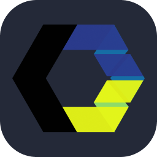

  
  

    

       
    

     
    <table>
      <caption>
        
      </caption>
      <tr>
        <td align="center">🛠 Develop</td>
        <td>
          
          
          
          
          
          
        </td>
      </tr>
      <tr>
        <td align="center">🎨 Design</td>
        <td>
          
          
          
        </td>
      </tr>
      <tr>
        <td align="center">⚡ Tool</td>
        <td>
          
          
          
        </td>
      </tr>
    </table>
     
    

      
      
    

     
    <iframe data-testid="embed-iframe" style="border-radius:12px" src="https://open.spotify.com/embed/track/3vliHQoqWojyV9jvotZVCy?utm_source=generator" width="75%" height="152" frameBorder="0" allowfullscreen="" allow="autoplay; clipboard-write; encrypted-media; fullscreen; picture-in-picture" loading="lazy"></iframe>
     
     
  

