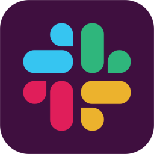

  
  

     
  

   
   
  
  <table>
    <tr>
      <td align="center">🛠 Develop</td>
      <td>
        
        
        
        
        
      </td>
    </tr>
    <tr>
      <td align="center">🎨 Design</td>
      <td>
        
        
        
      </td>
    </tr>
    <tr>
      <td align="center">⚡ Tools</td>
      <td>
        
        
        
        
        
      </td>
    </tr>
  </table>
   
  

    
    
  

   
  

   
  <em>I look forward to solving great challenges together with you. ❤️‍🔥</em>
   
   
  
   
   
  

